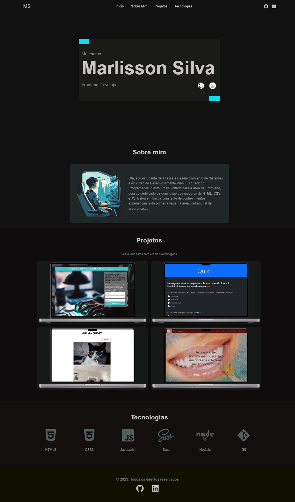
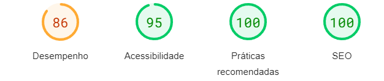

<h1 align="center"> Portfólio </h1>

Esse é meu portfólio de desenvolvedor frontend 

 

  

## 🚀 Tecnologias

Esse projeto foi desenvolvido com as seguintes tecnologias:

- HTML
- Sass
- JavaScript
- Git e Github

## ✍️ Descrição

Meu portfólio mostrando alguns dos projetos que já desenvolvi até o momento, buscando demonstrar e praticar meus conhecimentos. 

<!-- Desenvolvendo buscando as boas práticas, com intuito de entregar a melhor aplicação possível.

Mobile

Desktop
 -->

<!-- - Eventos de formulário (envio do form),
- Obtenção de dados do usuário (respostas por meio do input radio),
- Validações de inputs, onde pelo menos uma das alternativas tem que está marcada.
- Manipulação da DOM ( container de amostra da pontuação, animação do scroll) -->

<!-- ## 💻 Projeto

É um quiz sobre os times de futebol brasilero, para testar seus conhecimentos sobre o nosso futebol. Onde o usuário tem 10 questões com 4 alternativas de respostas para cada.
E ao fim do questionário após o envio vem a animação de scroll até o topo para visualização da pontuação, tendo uma animação a mais quando é obtido a pontuação máxima. -->

- [Visite o projeto online](https://marlissonsilva.com.br/)
